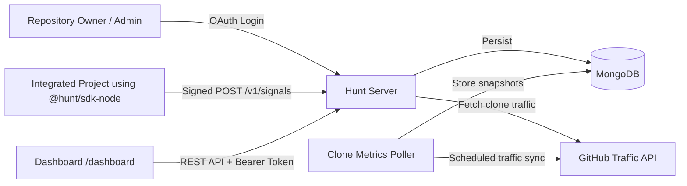
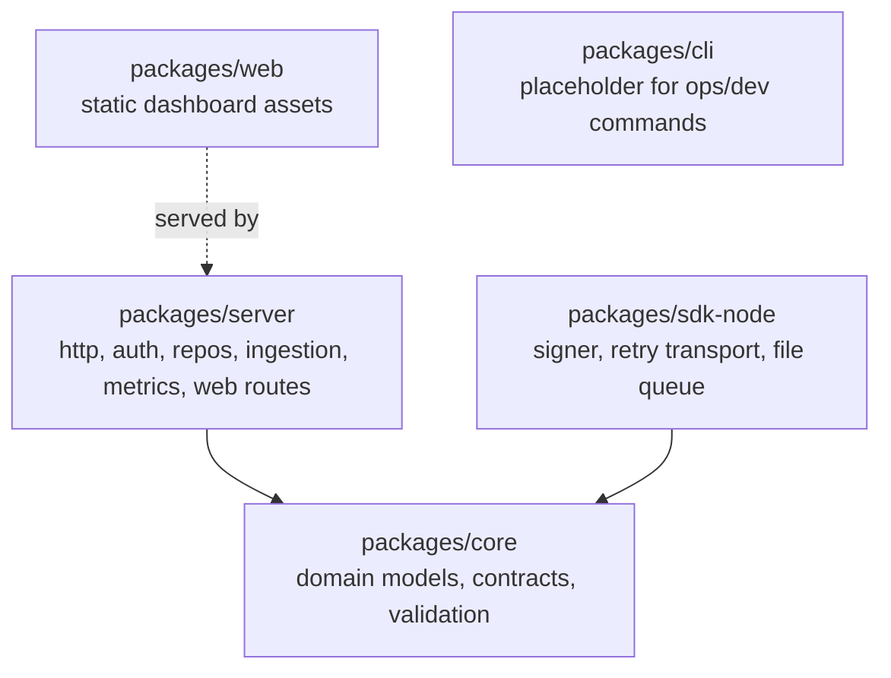
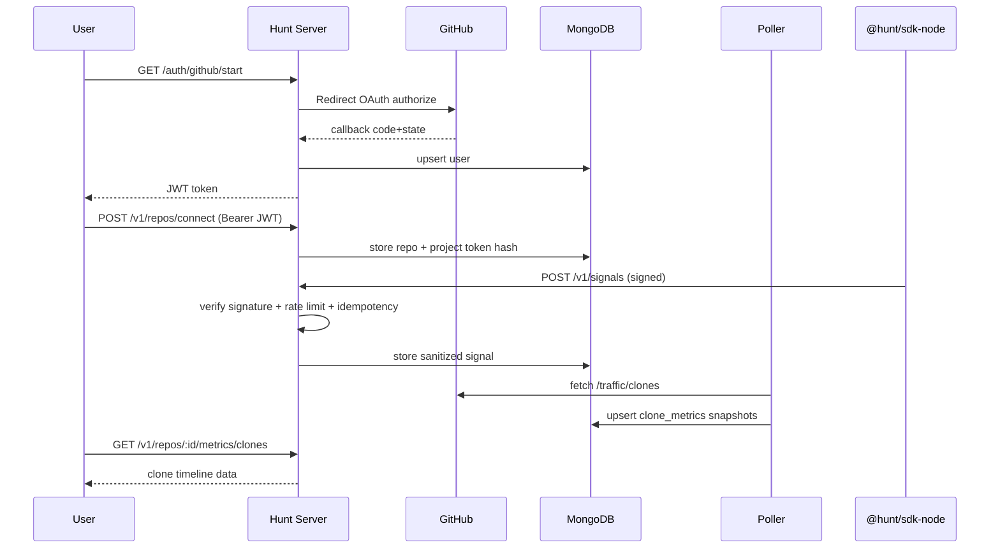

# Hunt - Clone Intelligence Platform

Hunt is a framework-free, modular, TypeScript monorepo that helps repository owners understand clone activity around their GitHub projects.

It combines:
- a Node.js HTTP API server,
- a reusable Node SDK for signed ingestion,
- MongoDB-backed persistence,
- a minimal dashboard UI,
- and operational docs for running and hardening the system.

---

## Table of contents

- [What the application does](#what-the-application-does)
- [Important GitHub limitation](#important-github-limitation)
- [Architecture](#architecture)
- [Monorepo structure](#monorepo-structure)
- [How Hunt works end-to-end](#how-hunt-works-end-to-end)
- [Features implemented](#features-implemented)
- [Setup and local development](#setup-and-local-development)
- [How to run the server](#how-to-run-the-server)
- [API overview](#api-overview)
- [SDK usage and embedding in other codebases](#sdk-usage-and-embedding-in-other-codebases)
- [Security model](#security-model)
- [Testing and quality gates](#testing-and-quality-gates)
- [Operations and release documentation](#operations-and-release-documentation)
- [Current limitations and roadmap notes](#current-limitations-and-roadmap-notes)

---

## What the application does

Hunt provides infrastructure to:

1. Authenticate repository owners via GitHub OAuth.
2. Connect repositories and manage repository-level settings.
3. Ingest signed telemetry signals from integrated projects (SDK).
4. Store and deduplicate clone traffic snapshots from GitHub Traffic APIs.
5. Capture identity claims (opt-in, authenticated user context).
6. Expose analytics endpoints and a lightweight dashboard.

---

## Important GitHub limitation

GitHub does **not** expose the identity of every public `git clone` user directly.

Hunt is therefore designed around:
- aggregate clone metrics (from GitHub traffic endpoints),
- signed integration signals,
- and explicit identity claims (authenticated/opt-in),
rather than claiming guaranteed identity for every clone event.

---

## Architecture

### High-level component diagram



### Package architecture



---

## Monorepo structure

```text
hunt/
  docs/
  packages/
    core/
    server/
    sdk-node/
    web/
    cli/
  tasks/
```

### Package responsibilities

- `packages/core`
  - shared domain entities, repository interfaces, validation, config loading
- `packages/server`
  - framework-free HTTP server, middleware stack, route modules, Mongo adapters
- `packages/sdk-node`
  - reusable Node client for signed event ingestion with retries and optional queue
- `packages/web`
  - static dashboard assets (`/dashboard`)
- `packages/cli`
  - placeholder package for future command tooling

---

## How Hunt works end-to-end

### Runtime flow



---

## Features implemented

- OAuth login endpoints:
  - `GET /auth/github/start`
  - `GET /auth/github/callback`
- Repository management:
  - `POST /v1/repos/connect`
  - `GET /v1/repos`
  - `GET /v1/repos/:repoId`
  - `PATCH /v1/repos/:repoId/settings`
- Ingestion:
  - `POST /v1/signals` (HMAC signature + idempotency + rate limit + sanitization)
  - `POST /v1/claims`
- Analytics reads:
  - `GET /v1/repos/:repoId/metrics/clones`
  - `GET /v1/repos/:repoId/claims`
- Metrics poller:
  - GitHub clone traffic fetching + retry/backoff + dedupe persistence
- Dashboard:
  - `/dashboard` static UI with repo list, clone chart, claims list
- Node SDK:
  - signed capture, retry/timeout, optional file-backed queue
- Hardening:
  - security headers, payload size limits, vulnerability audit run

---

## Setup and local development

### Prerequisites

- Node.js `>= 20`
- npm
- MongoDB
- GitHub OAuth application credentials

### Install

```bash
npm install
```

### Run in development

```bash
npm run dev
```

### Run as built app

```bash
npm run start
```

### Configure environment

Create `.env` from `.env.example` and set at least:

- `HUNT_MONGODB_URI`
- `HUNT_MONGODB_DB_NAME`
- `HUNT_GITHUB_CLIENT_ID`
- `HUNT_GITHUB_CLIENT_SECRET`
- `HUNT_JWT_SECRET`
- `HUNT_SIGNING_SECRET`

### Validate build and tests

```bash
npm run build
npm run typecheck
npm run test
```

---

## How to run the server

The server is intentionally framework-free and exposed via composable modules.

Use `createHttpApp()` from `packages/server` with your chosen bootstrap file/process manager.

### Minimal bootstrap example

```ts
import { createServer } from "node:http";
import {
  createHttpApp,
  createMongoRepositories,
  MongoConnectionManager,
} from "@hunt/server";

const mongo = new MongoConnectionManager({
  uri: process.env.HUNT_MONGODB_URI ?? "",
  dbName: process.env.HUNT_MONGODB_DB_NAME ?? "hunt_dev",
});

const ctx = await mongo.connect();
const repos = createMongoRepositories(ctx.collections);

const app = createHttpApp({
  config: {
    logging: { level: "info" },
    auth: {
      githubClientId: process.env.HUNT_GITHUB_CLIENT_ID ?? "",
      githubClientSecret: process.env.HUNT_GITHUB_CLIENT_SECRET ?? "",
      jwtSecret: process.env.HUNT_JWT_SECRET ?? "",
    },
    ingestion: {
      signatureSecret: process.env.HUNT_SIGNING_SECRET ?? "",
    },
  },
  authDependencies: { userRepository: repos.users },
  repositoryDependencies: {
    repositoryRepository: repos.repositories,
    cloneMetricRepository: repos.cloneMetrics,
    identityClaimRepository: repos.identityClaims,
  },
  ingestionDependencies: {
    repositoryRepository: repos.repositories,
    signalRepository: repos.signals,
    identityClaimRepository: repos.identityClaims,
  },
});

createServer((req, res) => void app.handle(req, res)).listen(4000);
```

---

## API overview

### Health

- `GET /health`

### Auth

- `GET /auth/github/start`
- `GET /auth/github/callback`

### Repositories

- `POST /v1/repos/connect`
- `GET /v1/repos`
- `GET /v1/repos/:repoId`
- `PATCH /v1/repos/:repoId/settings`
- `GET /v1/repos/:repoId/metrics/clones`
- `GET /v1/repos/:repoId/claims`

### Ingestion

- `POST /v1/signals`
- `POST /v1/claims`

---

## SDK usage and embedding in other codebases

Use `@hunt/sdk-node` in any Node project:

```ts
import { createCloneIntelClient } from "@hunt/sdk-node";

const client = createCloneIntelClient({
  apiBaseUrl: "http://localhost:4000",
  repositoryId: "repo_123",
  signingSecret: process.env.HUNT_SIGNING_SECRET ?? "",
  retry: { attempts: 3, baseDelayMs: 250 },
  timeoutMs: 5000,
  queue: { enabled: true, filePath: ".hunt/queue.json" },
});

await client.captureEvent("integration_initialized", {
  sessionId: "session_abc",
  metadata: { source: "postinstall" },
});
```

See full SDK docs:
- `packages/sdk-node/README.md`

---

## Security model

- JWT-based local auth session
- HMAC signed ingestion requests
- Signature timestamp window validation
- Ingestion rate limiting
- Idempotency support for retries/replays
- Sensitive metadata hashing/redaction before persistence
- Security response headers
- JSON payload size limiting

---

## Testing and quality gates

Quality gates:

```bash
npm run test
npm run build
npm run typecheck
```

Coverage includes:
- core domain/config unit tests
- server route/auth/repo/ingestion/metrics tests
- critical-path end-to-end test
- SDK integration tests

---

## Operations and release documentation

- `docs/OPERATIONS_RUNBOOK.md`
- `docs/DEPLOYMENT_CHECKLIST.md`
- `docs/TROUBLESHOOTING.md`
- `docs/SECURITY_HARDENING_CHECKLIST.md`
- `docs/RELEASE_NOTES_MVP.md`

---

## Current limitations and roadmap notes

- GitHub clone identity cannot be fully resolved for every clone without user participation.
- Some runtime stores are in-memory defaults (state/rate-limit) and should be replaced with distributed stores in multi-instance production.
- Dashboard is intentionally minimal and framework-free.

---

## License and dependencies

Project dependencies are open-source and audited via:

```bash
npm audit --omit=dev
```

At last audit during MVP hardening: no production vulnerabilities were reported.
